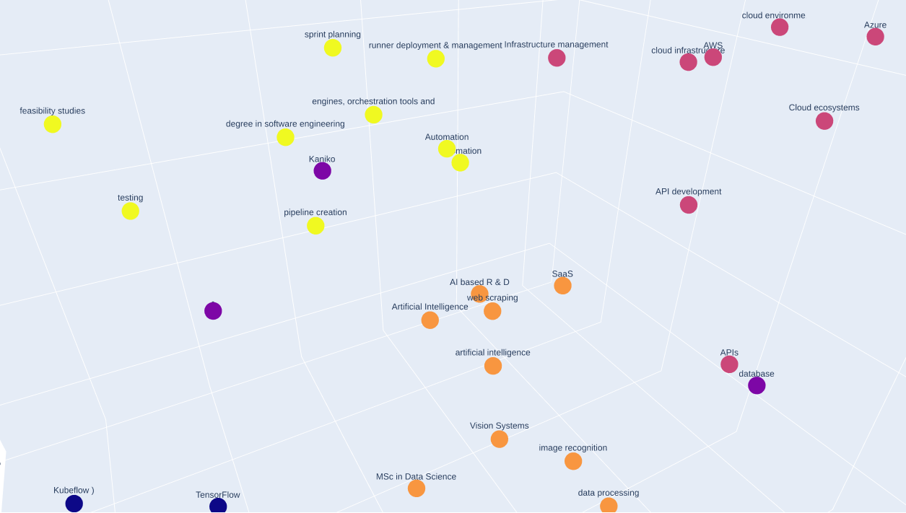
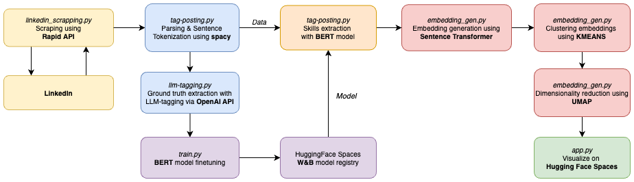

<h1>
  
  In-demand Skill Monitoring for Machine Learning Industry
</h1>

## About

This projects aims to monitor in-demand skills for machine learning roles. Skills are extracted with a BERT-based skill extraction model called JobBERT, which is continously fine-tuned on the job postings. The skills are monitored/visualized by: 1. embedding the extracted skills tokens into vector form, 2. performing dimensionality reduction with UMAP, 3. visualizing the reduced embeddings. 

### [Monitoring Platform Link](https://huggingface.co/spaces/Robzy/jobbert_knowledge_extraction)

<h2>
  
  Architecture & Frameworks
</h2>

- **Hugging Face Spaces**: Used as an UI to host interactive visualisation of skills embeddings and their clusters.
- **GitHub Actions**: Used to schedule training, inference and visualisation-updating scripts.
- **Rapid API**: The API used to scrape job descriptions from LinkedIn
- **Weights & Biases**: Used for model training monitoring as well as model storing.
- **OpenAI API**: Used to extract ground-truth from job descriptions by leveraging multi-shot learning and prompt engineering.

# High-Level Overview

## Models
* **BERT** - finetuned skill extraction model, lightweight.
* **LLM** - gpt-4o for skill extraction with multi-shot learning. Computationally expensive.
* **Embedding model** - [SentenceTransformers](https://sbert.net/) used to embed skills into vectors.
* [**spaCy**](https://spacy.io/models/en#en_core_web_sm) - sentence tokenization model. 

## Pipeline

The follow scripts are scheduled to automate the skill monitoring and model tranining processes continually. 

### 1. Job-posting scraping
Fetching job descriptions for machine learning from LinkedIn via Rapid API.
### 2. Skills tagging with LLM
We opinionately extract the ground truth of skills from the job descriptions by leveraging multi-shot learning and prompt engineering.
### 3. Model training
The skill extraction model is finetuned with respect to the extracted groundtruth.
### 4. Skills tagging with JobBERT
Skills are extracted from job-postings with finetuned model
### 5. Embedding & visualization
Extracted skills are embedded, reduced and clustered with an embedding model, UMAP and K-means respectively.
### 6. Pipeline Flow

    

# Job Scraping

This component scrapes job descriptions from the LinkedIn Job Search API for Machine Learning, and saves them in text files for further analysis.

## Workflow

1. **API Configuration**:
   - The script uses the `linkedin-job-search-api.p.rapidapi.com` endpoint to fetch job data.
   - API access is authenticated using a RapidAPI key stored as an environment variable `RAPID_API_KEY`.

2. **Data Retrieval**:
   - The script fetches jobs matching the keyword `machine learning`.
   - It retrieves job details including the description, which is saved for further analysis.

3. **Job Description Extraction**:
   - Each job description is saved in a `.txt` file under the `job-postings/<date>` folder.
   
# Skill Embeddings and Visualization

We generate embeddings for technical skills listed in .txt files and visualizes their relationships using dimensionality reduction and clustering techniques. The visualizations are created for both 2D and 3D embeddings, and clustering is performed using KMeans to identify groups of similar skills.

## Workflow

### 1. Input Data
- Skills are loaded from `.txt` files located in date-based subfolders under the `./tags` directory.
- Each subfolder corresponds to a specific date (e.g., `03-01-2024`).

### 2. Embedding Generation
- The script uses the `SentenceTransformer` model (`paraphrase-MiniLM-L3-v2`) to generate high-dimensional embeddings for the unique skills.

### 3. Dimensionality Reduction
- UMAP (Uniform Manifold Approximation and Projection) is used to reduce the embeddings to:
  - **2D**: For creating simple scatter plots.
  - **3D**: For interactive visualizations.

### 4. Clustering
- KMeans clustering is applied to the 3D embeddings to group similar skills into clusters.
- The number of clusters can be specified in the script.

### 5. Visualization and Outputs
- **2D Projection**: Saved as PNG images in the `./plots` folder.
- **3D Projection**: Saved as interactive HTML files in the `./plots` folder.
- **3D Clustering Visualization**: Saved as HTML files, showing clusters with different colors.

